<div align="center">

# 💊 Рецептурные бланки

**Интерактивная учебная презентация для студентов медицинских и фармацевтических специальностей:** какие бывают рецептурные бланки, из чего состоит рецепт и как его правильно оформить.

[](https://fegke12.github.io/recept-blanki/)


<br>

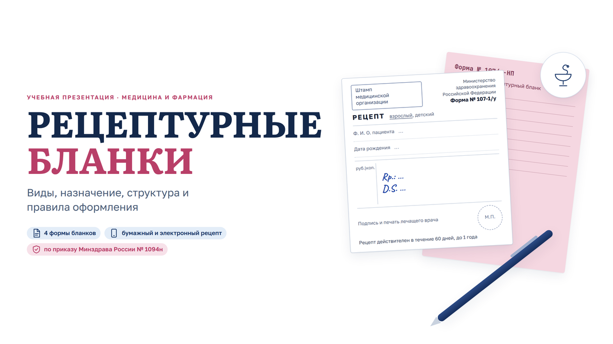

</div>

---

## О проекте

Презентация к занятию по фармакологии/фармации. Работает прямо в браузере — ничего не нужно скачивать и устанавливать, открывается и на проекторе, и с телефона. Материал выстроен от простого к сложному: что такое рецепт → виды бланков → структура и заполнение → ошибки → электронный рецепт → практика и тест.

## Содержание

| Раздел | Слайды |
|---|---|
| **Основы** | что такое рецептурный бланк, зачем нужен рецепт |
| **Виды бланков** | четыре основные формы и когда какая применяется |
| **Оформление** | структура рецепта по полям, порядок заполнения, латинские обозначения, реквизиты и степени защиты |
| **Ошибки** | типичные ошибки, из‑за которых аптека не отпустит препарат |
| **Электронный рецепт** | бумажный и электронный рецепт, путь рецепта от врача до аптеки |
| **Тест** | ситуационное задание с ответом, мини‑викторина с ответами |
| **Итоги** | интересные факты, главное, источники |

## Возможности

- 🖥 **18 слайдов 16:9**, которые масштабируются под любой экран; на телефоне — отдельная «текучая» вёрстка.
- ⌨️ **Управление с клавиатуры:** `←` `→`, `PageUp` / `PageDown` (подходит для кликера), `Home` / `End`.
- 🧭 **Меню разделов** — переход к нужной теме в один клик.
- 🔗 **Ссылки на слайд:** `#s5` откроет сразу пятый слайд — удобно отправить студентам.
- 🙈 **Ответы под спойлером** — в задании и викторине ответ открывается по клику, сначала можно подумать.
- 🌗 **Тёмная тема** по настройке системы и **щадящий режим** для тех, у кого отключена анимация.

## Слайды

<table>
  <tr>
    <td>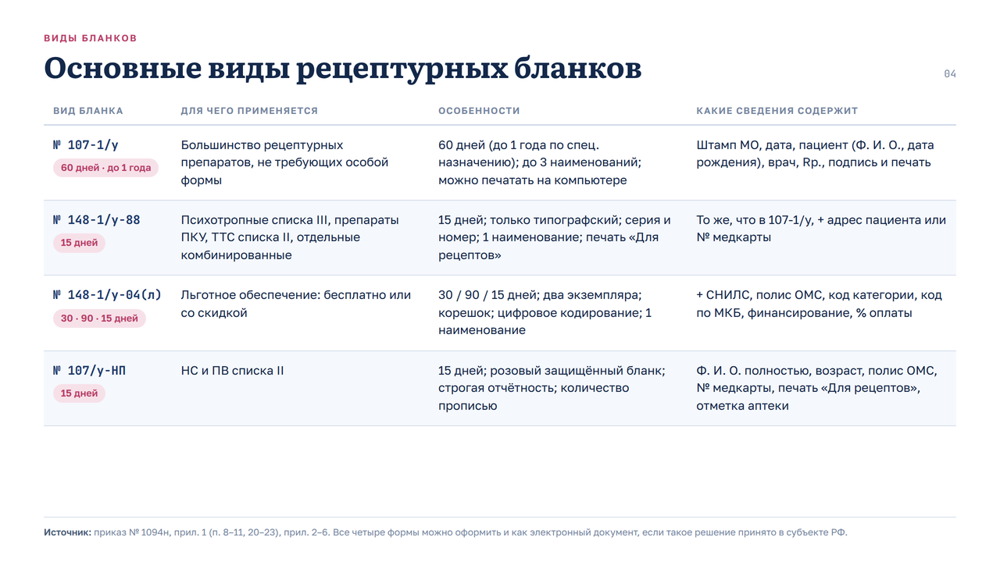</td>
    <td>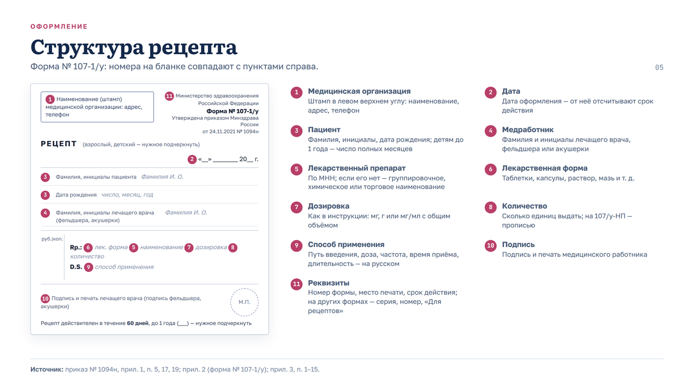</td>
  </tr>
  <tr>
    <td align="center"><sub>Основные виды бланков</sub></td>
    <td align="center"><sub>Структура рецепта</sub></td>
  </tr>
  <tr>
    <td>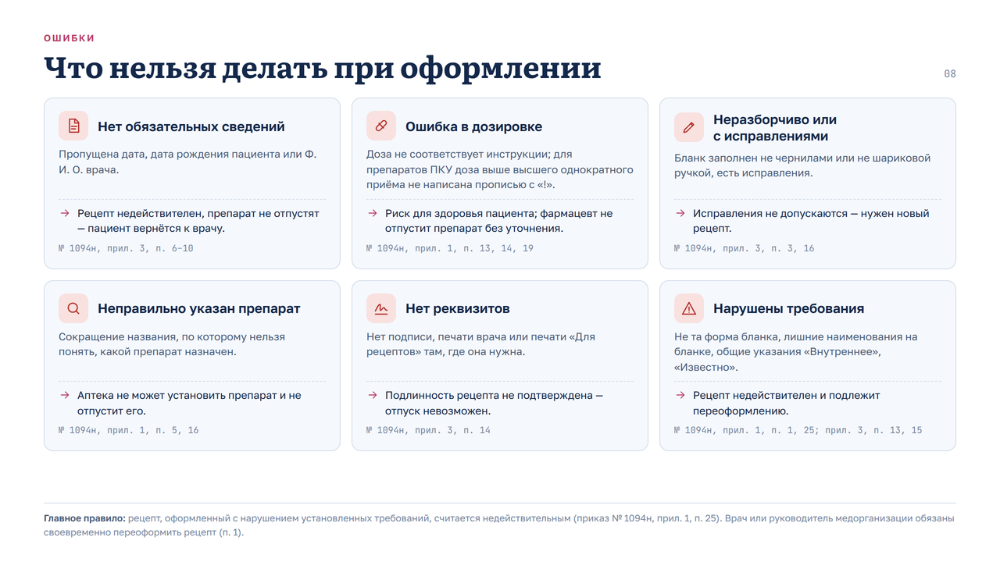</td>
    <td>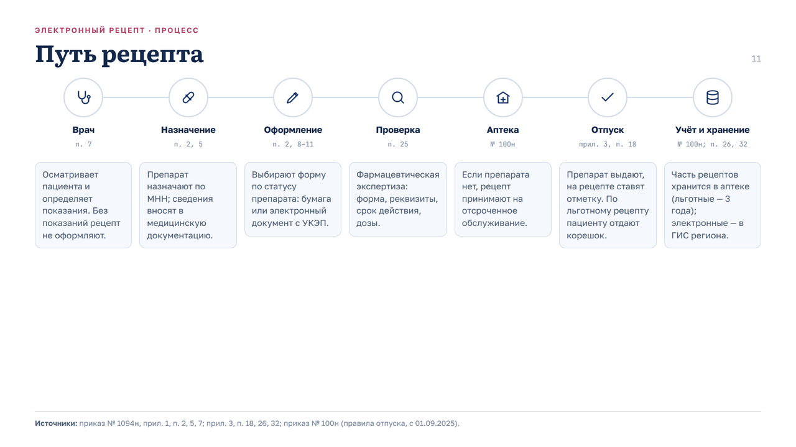</td>
  </tr>
  <tr>
    <td align="center"><sub>Типичные ошибки</sub></td>
    <td align="center"><sub>Путь рецепта</sub></td>
  </tr>
  <tr>
    <td>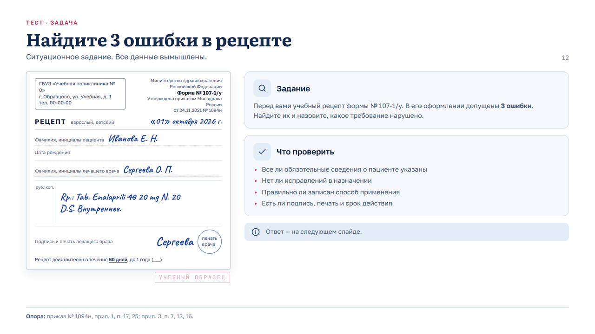</td>
    <td>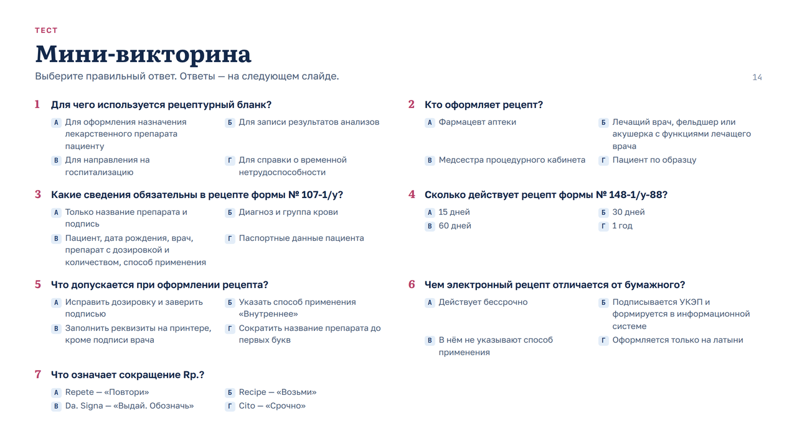</td>
  </tr>
  <tr>
    <td align="center"><sub>Ситуационное задание</sub></td>
    <td align="center"><sub>Мини‑викторина</sub></td>
  </tr>
</table>

<details>
<summary><b>Все 18 слайдов</b></summary>
<br>

| | |
|---|---|
| <br><sub>1. Титульный</sub> | 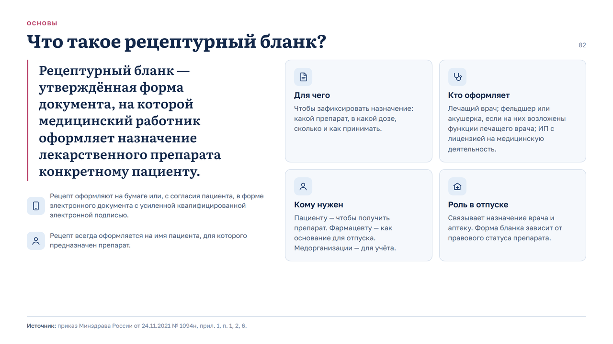<br><sub>2. Что такое рецептурный бланк</sub> |
| 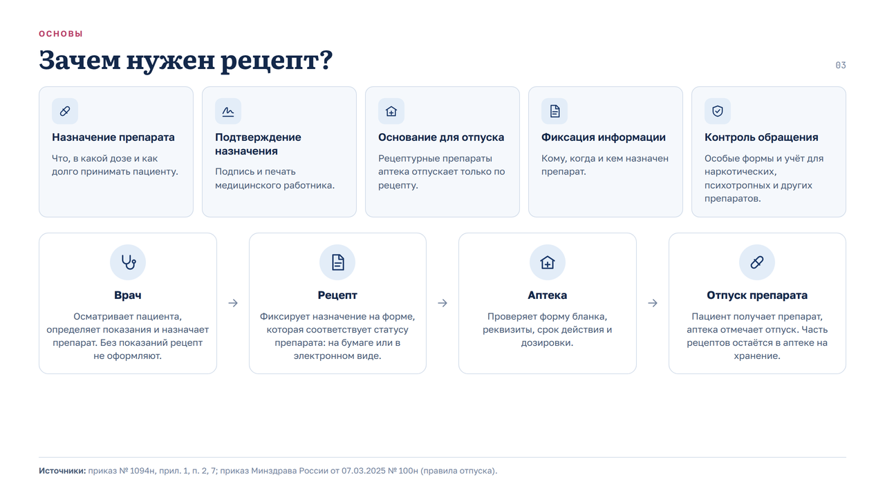<br><sub>3. Зачем нужен рецепт</sub> | <br><sub>4. Основные виды бланков</sub> |
| <br><sub>5. Структура рецепта</sub> | 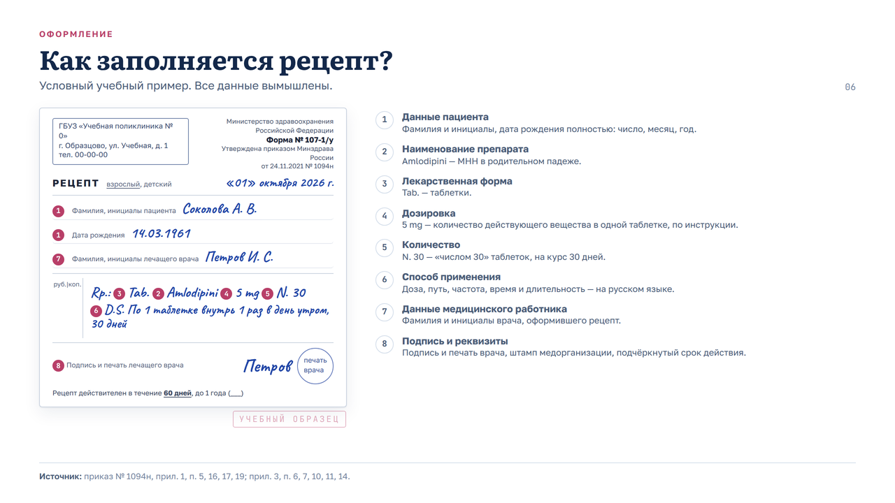<br><sub>6. Как заполняется рецепт</sub> |
| 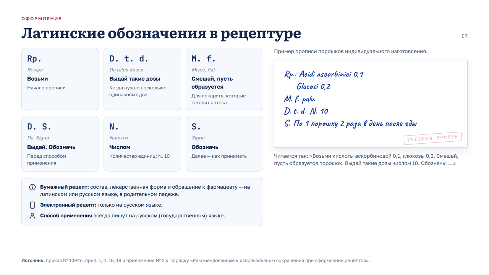<br><sub>7. Латинские обозначения</sub> | <br><sub>8. Типичные ошибки</sub> |
| 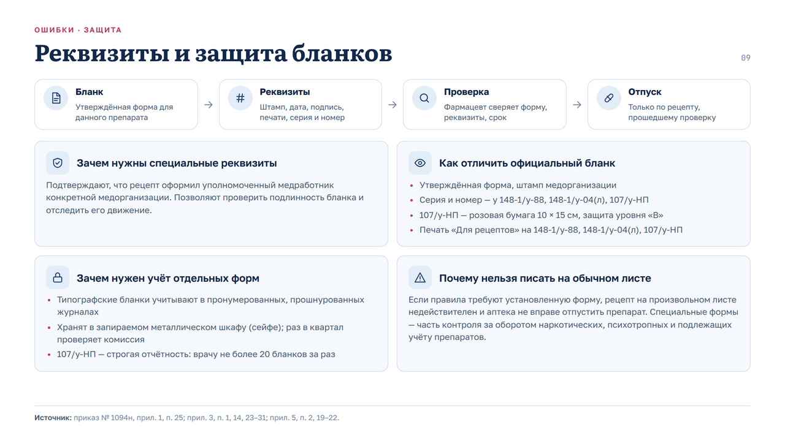<br><sub>9. Реквизиты и защита</sub> | 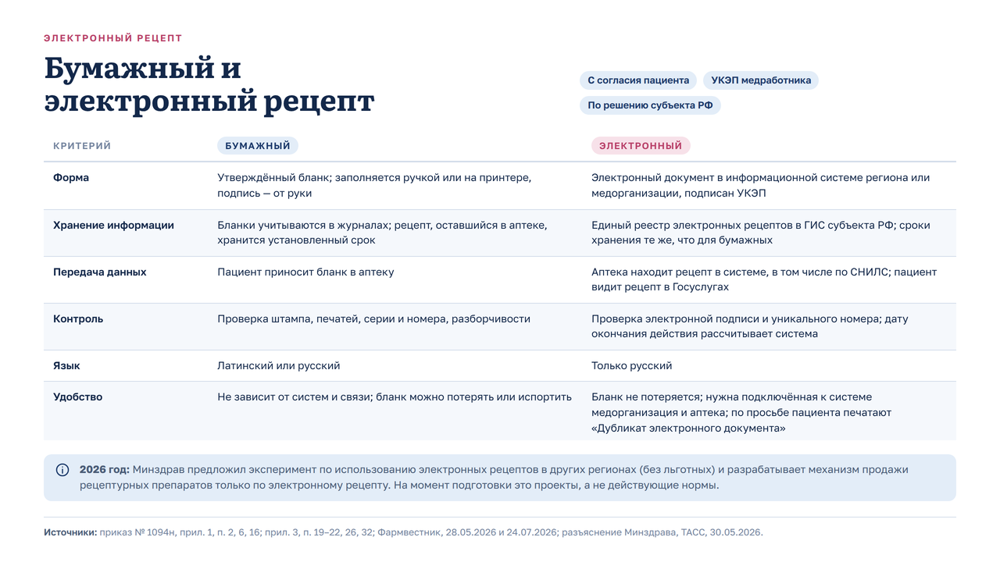<br><sub>10. Бумажный и электронный рецепт</sub> |
| <br><sub>11. Путь рецепта</sub> | <br><sub>12. Ситуационное задание</sub> |
| 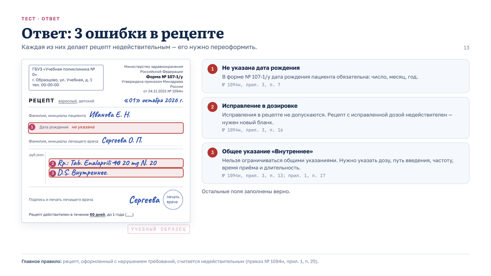<br><sub>13. Ответ к заданию</sub> | <br><sub>14. Мини‑викторина</sub> |
| 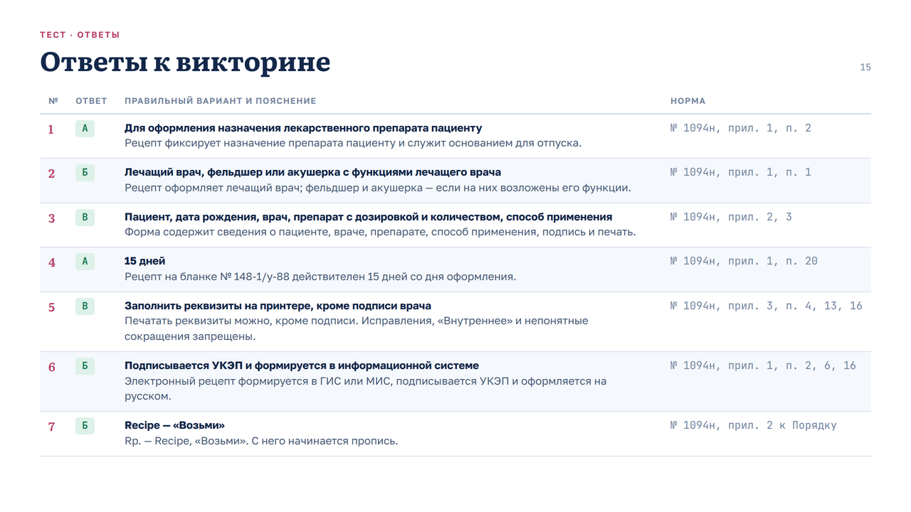<br><sub>15. Ответы к викторине</sub> | 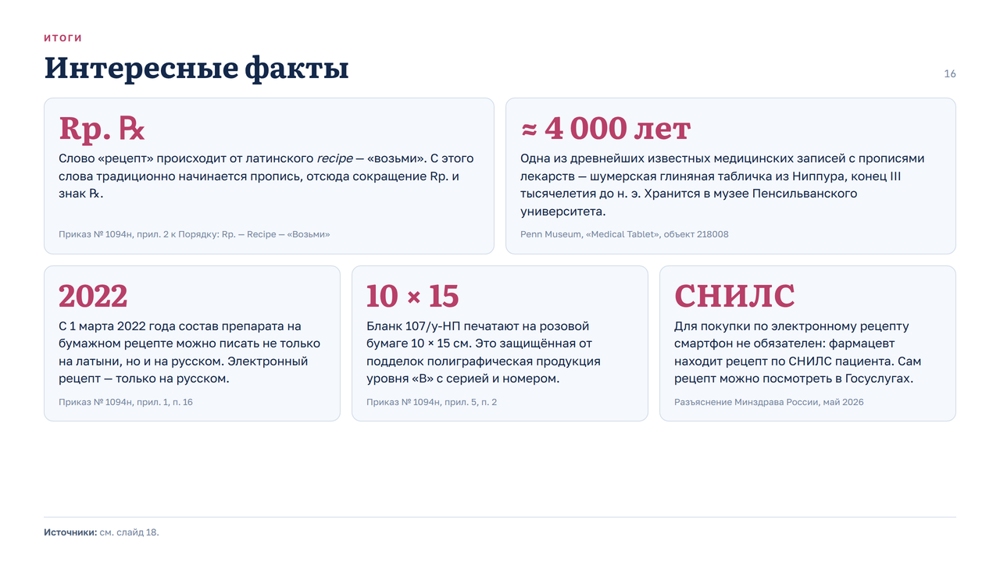<br><sub>16. Интересные факты</sub> |
| 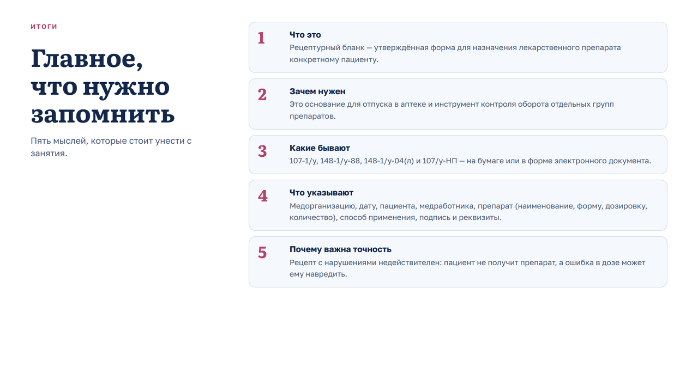<br><sub>17. Главное</sub> | 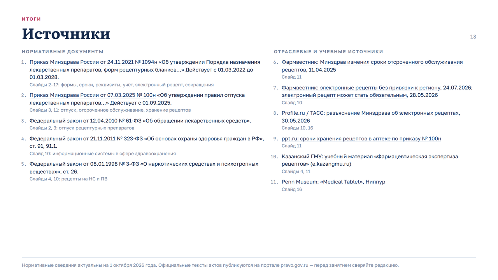<br><sub>18. Источники</sub> |

</details>

## Источники

- Приказ Минздрава России от 24.11.2021 № 1094н — порядок назначения лекарственных препаратов, формы рецептурных бланков и порядок их оформления (приложения 1–6).
- Приказ Минздрава России от 07.03.2025 № 100н — правила отпуска лекарственных препаратов аптеками (действуют с 01.09.2025).

Все ФИО, даты и данные в примерах рецептов вымышлены. Презентация — учебный материал и не заменяет нормативные документы.

## Как запустить

Вся презентация — один файл `index.html`, без сборки и зависимостей. Откройте его в браузере или посмотрите онлайн на GitHub Pages.

```
index.html     презентация целиком: разметка, стили, навигация
screenshots/   превью слайдов для README
```

---

<div align="center"><sub>Сделано <a href="https://github.com/Fegke12">@Fegke12</a></sub></div>
